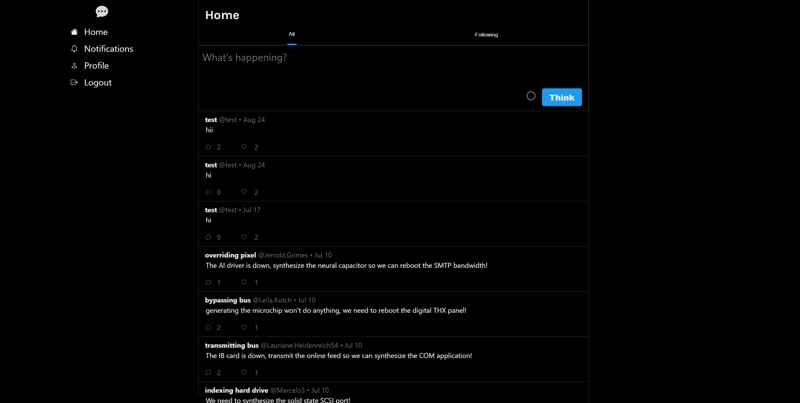

# 🧠 Deep Thoughts

A clean, community-powered platform to share and respond to personal thoughts. Built with the MERN stack + GraphQL for a fast, expressive experience.



---

## 📋 Table of Contents

1. [✨ Features](#features)
2. [🚀 Installation](#installation)
3. [🧪 Usage](#usage)
4. [🛠️ Support](#support)
5. [📄 License](#license)

---

## ✨ Features

- **User Profiles**  
  Create a profile, share thoughts, and start discussions.

- **Threaded Comments**  
  Spark conversations with replies and reactions.

- **GraphQL Backend**  
  Fast data-fetching and intuitive dev experience.

- **Responsive Design**  
  Works seamlessly across devices.

---

## 🚀 Installation

### Prerequisites

- [Node.js](https://nodejs.org/)
- [MongoDB Community Edition](https://www.mongodb.com/try/download/community)

### Setup Steps

#### 1. Clone the repository
```bash
git clone https://github.com/blakee-marcus/deep-thoughts.git
```

#### 2. Move into the project folder
```bash
cd deep-thoughts
```
#### 3. Install all dependencies (client + server)
```bash
npm install
```
#### 4. Start the development environment
```bash
npm run develop
```
#### 5. For a production build
```bash
npm run build
```
#### 6. Preview the build
```bash
npm run preview
```
---
## 🧪 Usage

### Once running:

  * Visit http://localhost:3000 in your browser.

  * Create a profile or log in.

  * Post a thought, leave comments, and connect with others.

  * Explore community discussions and user profiles.

---
## 🛠️ Support

Need help or want to get in touch?

📬 me@blakemarcus.com

---
## 📄 License

© 2025 Blake Marcus. All rights reserved.
Unauthorized duplication or distribution is prohibited without written permission.

---
